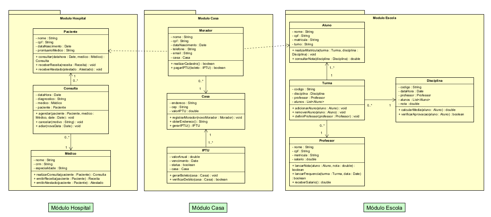
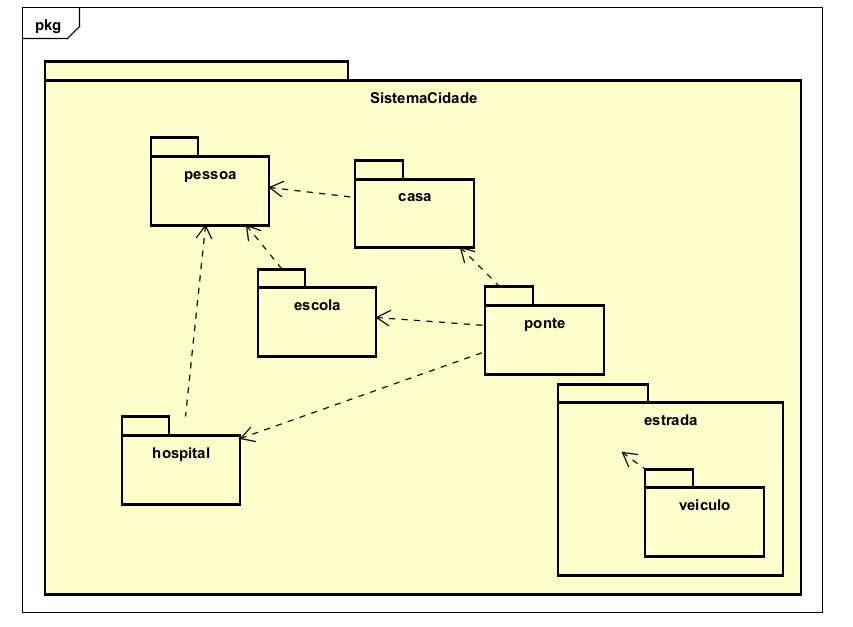
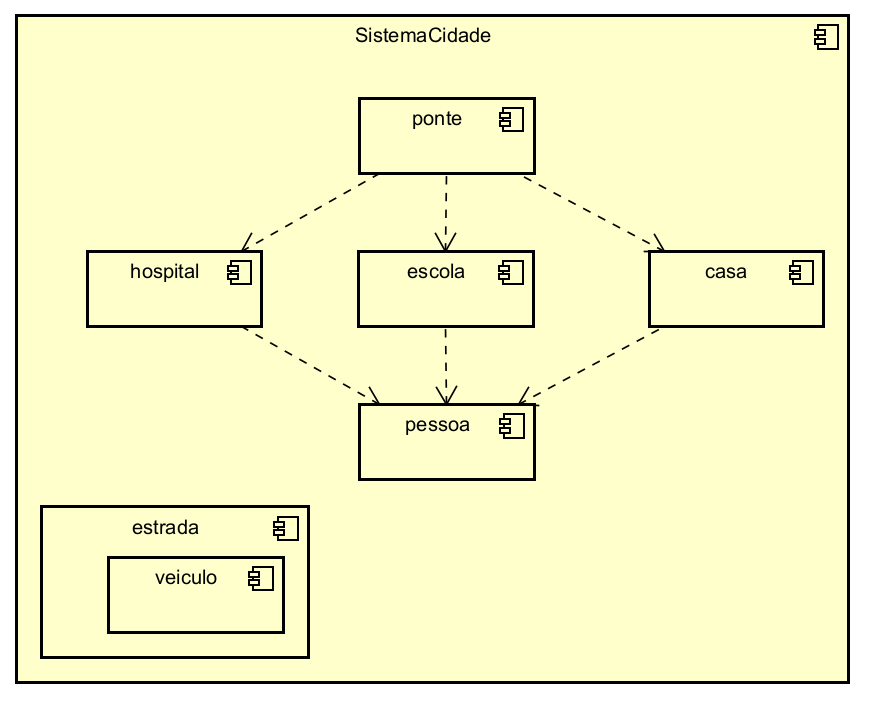
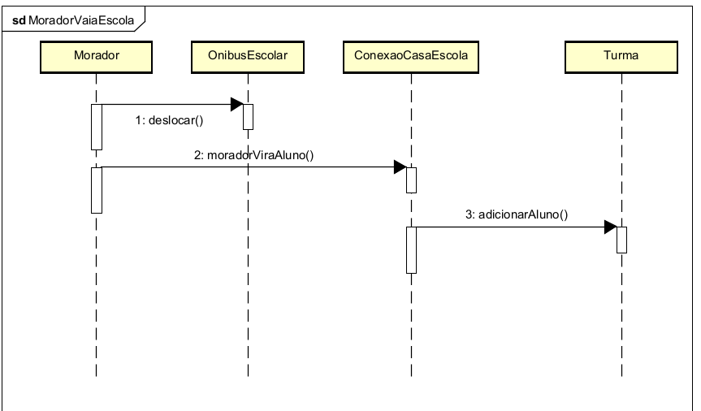

# Sistema Cidade 

Projeto desenvolvido para a disciplina de Engenharia de Software II, com o objetivo de demonstrar a diferença entre código monolítico e código modular/reutilizável, aplicando conceitos de orientação a objetos, interfaces e herança em Java.

---

## Ideia do Projeto

O sistema foi modelado como uma cidade, onde cada parte da cidade representa um módulo de software. Assim como uma cidade possui hospitais, escolas e casas que se comunicam por meio de estradas e pontes, o sistema possui módulos que se comunicam por meio de interfaces reutilizáveis.

A analogia central do projeto é baseada no conceito de **Lego**:

| Lego | Software |
|---|---|
| Peça | Classe |
| Bloco | Módulo |
| Conjunto | Sistema |
| Encaixe | Interface |

---

## Estrutura do Projeto

```
SistemaCidade/
├── src/
│   ├── pessoa/
│   │   └── Pessoa.java             ← classe base de todos os papéis
│   ├── estrada/
│   │   ├── Estrada.java            ← interface de reusabilidade
│   │   └── veiculo/
│   │       ├── Veiculo.java
│   │       ├── Ambulancia.java
│   │       ├── Carro.java
│   │       └── OnibusEscolar.java
│   ├── ponte/
│   │   ├── Ponte.java              ← interface de reusabilidade
│   │   ├── ConexaoCasaHospital.java
│   │   ├── ConexaoCasaEscola.java
│   │   └── ConexaoHospitalEscola.java
│   ├── hospital/
│   │   ├── Paciente.java
│   │   ├── Medico.java
│   │   └── Consulta.java
│   ├── escola/
│   │   ├── Professor.java
│   │   ├── Aluno.java
│   │   ├── Turma.java
│   │   └── Disciplina.java
│   ├── casa/
│   │   ├── Morador.java
│   │   ├── Casa.java
│   │   └── IPTU.java
│   └── Main.java
└── diagramas/
    ├── diagrama_classes.png
    ├── diagrama_pacotes.png
    ├── diagrama_componentes.png
    └── diagrama_sequencia.png
```

---

## Módulos de Reusabilidade

### Estrada
Interface que define o contrato de deslocamento entre pontos da cidade. Qualquer veículo que precise se mover no sistema implementa essa interface.

```java
public interface Estrada {
    String getOrigem();
    String getDestino();
    void deslocar(String origem, String destino);
}
```

### Ponte
Interface que define o contrato de conexão entre módulos. As pontes permitem que um Morador assuma diferentes papéis dependendo do módulo em que está.

```java
public interface Ponte {
    void conectar(String moduloA, String moduloB);
    boolean isConectado();
    void desconectar();
}
```

Por exemplo, o mesmo `Morador` pode virar `Paciente` ao ir ao Hospital, ou `Aluno` ao ir à Escola, sem duplicar nenhum dado.

---

## Diagramas UML

### Diagrama de Classes
Mostra as classes de cada módulo e seus relacionamentos.



### Diagrama de Pacotes
Mostra a separação lógica dos módulos e suas dependências.



### Diagrama de Componentes
Mostra os componentes do sistema e como eles dependem uns dos outros.



### Diagrama de Sequência
Mostra a interação entre os módulos quando um Morador vai à Escola.



---

## Como executar

1. Clone o repositório:
```bash
git clone https://github.com/ale-nvc/SistemaCidade.git
```

2. Abra o projeto no IntelliJ IDEA

3. Execute o arquivo `Main.java`